# NS final project
## 1. Exposed RDP with weak password

Remote Desktop Service (RDS) allows remote users to access a computer over a network and control it using the Windows graphical user interface. In order to connect the remote clients to the computers running RDS, Remote Desktop Protocol (RDP) is used.

However, vulnerabilities were found since remote services had been widely used due to the spread of COVID-19.

Below discussions of the scenario - **Exposed RDP with weak password**, will mainly focus on these vulnerabilities:
- weak credentials
  - the attacker may try to brute-force the weak credentials and gain access to the victim machine. As a result, we might see some *failed to login* messages in the logs.

- unrestricted port access
  - some known ports, such as RDP (3389), SMB (445), mDNS (5353)
  - the attacker may do port scanning to find the open ports.

## 2. Indicator of Compromise

In this section, we will discuss the events discovered from logs. Then, move on to deducing the IoCs in this scenario.


*fig 2.1 kibana winlog **event.code** frequency*

### 2.1 Discovery
For this scenario, we have two sources of logs, <font color="#E07400">winlog (with sysmon) and zeek</font>. While winlog collects logs on the victim machine for security or any application messages, zeek collects logs about the network traffic.

#### winlog with sysmon
In *fig 2.1*, it shows the distribution of event codes in winlog.

For simplicity, we separated these events into four parts for discussion: process creation, logon logs, network and firewall related, and noise.

1. process creation - 4688, 1
2. <font color="#D62828">network and firewall related - 3, 5152, 5158, 5156</font>
	- 3 for network connection.
	- 5152 can show either the packet had been block or not.
3. <font color="#D62828">logon logs</font>
	- 4625 - an account failed to logon
		- Logs every failed attempt to logon to the local computers. This is useful in our scenario since the attacker may try to brute-force into victim machine, and we can see many details of the attacker from this log.
	- 4624 - an account was successfully logged on
		- this event tells us when the attacker have the credential to access victim machine.
4. others
	- sysmon: 11, 12, 13
	- noise
		- object access: 4656, 4663, 4690, 4658, 4660...
		- Error logs: 3006, 3008, 3018, 3016, 3009, 3010, 3019...


#### zeek

Since zeek logs are mainly describing the network traffic, we need to collect basic network information about the attacker and victim first. Then, we will focus on the fields: <font color="#E07400">origin host, origin port, response host, and response port</font> in zeek logs for deeper inspection.

### 2.2 IoC

1. Attacker’s IP address - 10.0.87.113

2. Victim’s IP address - 192.168.87.87

3. Filename of the ransomware - m.exe (dropper) and ETWMe.exe (ransomware)

#### analysis method

##### find the attacker

First, we filtered out the noise logs. Then, checked the logs with event code 4625. The amount of this event is about 1,500 hits, and all the source IP Address are the same, *10.0.87.113*.

Below is a piece of the messages from the logs.

```
An account failed to log on.

Account For Which Logon Failed:
	Security ID:		S-1-0-0
	Account Name:		Administrator
	Account Domain:		

Failure Information:
	Failure Reason:		Unknown user name or bad password.
	Status:				0xC000006D
	Sub Status:			0xC000006A

Network Information:
	Workstation Name:		kali
	Source Network Address:	10.0.87.113
	Source Port:			0
```
From this message, there exists some useful information for us to learn more about the attacker's behavoir. The attacker is working on a <font color="#4300B8">kali machine with IP: *10.0.87.13*</font>, and is trying to login as *administrator* on victim machine. Also, we can see that the failure reason might be wrong username or password. Additionally, the sub-status (0xC000006A) of failure reason implies that the user name is correct but the password is wrong. Therefore, we can deduce that <font color="#4300B8">the attacker has the victim machine username and that he is trying to brute-force into it with that username</font>.

##### find the victim

Since we have the attacker information, we then move forward to find the victim. In this step, we extracted the logs with event code 3, since we wanted to know which IP was the attacker trying to connect with.

The figure *fig 2.2.1* shows the frequency of source IP to destination IP over the timestamp in winlog with event code 3. The one with the highest frequency is <font color="#4300B8">the mapping of *10.0.87.113 to 192.168.87.87*</font>. Here we have the victim IP: *192.168.87.87*.


*fig 2.2.1 kibana winlog: **source_ip to dest_ip** frequency with time*

In order to learn more about the victim, here's another piece of message which comes from winlog with event code 3 and destination IP *192.168.87.87*. In conclusion, the victim machine <font color="#4300B8">hostname is *Alan-Win10* with IP *192.168.87.87*</font>. Also, we can see the open port that the attacker is trying to connect with is 3389, which is the port for <font color="#4300B8">RDP</font>.

```
Network connection detected:
RuleName: RDP
UtcTime: 2021-10-26 03:45:14.329
...
Protocol: 				tcp
Initiated: 				false
SourceIsIpv6: 			false
SourceIp: 				10.0.87.113
SourceHostname: 
SourcePort: 			60826
SourcePortName: 
DestinationIsIpv6: 		false
DestinationIp: 			192.168.87.87
DestinationHostname: 	Alan-Win10
DestinationPort: 		3389
DestinationPortName: 	ms-wbt-server
```

##### ransomware execution

The execution must be done <font color="#E07400">after the attacker had successful logged in to victim machine</font>. *fig. 2.2.2* shows the first successful login is at timestamp *Oct 26, 2021 @ 11:48:43.617* (with event code 4624 - an account was successfully logged on).


*fig 2.2.2 kibana winlog: attacker first login success*

Then, we check the logs with <font color="#E07400">process creation</font> event after the first login timestamp, which are shown in the below *fig 2.2.3*. Then frequencies starts increasing at about 11:56.


*fig 2.2.3 kibana winlog: event 1 & 4688 frequency after first successful login*


Also, from zeek logs (*fig 2.2.4*), we discovered a network traffic (*Oct 26, 2021 @ 11:56:46.755*) sending lots of bytes after the brute-forcing had done a while.

*fig 2.2.4 kibana zeek: new traffic after brute-forcing*

Therefore, we check the logs about process creation after the event. In *fig 2.2.5*, we concluded that:

- The attacker logged in as user, Alan (see 3.2 for description).
- Alan executed m.exe (dropper), which produced ETWMe.exe (ransomware).
- Alan executed ETWMe.exe.
- ETWMe.exe started to do malicious things on the victim machine.


*fig 2.2.5 kibana winlog: ransomware execution*

## 3. Timeline of the Attack

### 3.1 Timeline

```mermaid
gantt
    title Exposed RDP with weak password
    dateFormat	HH:mm:ss
    axisFormat	%H:%M:%S
    port scanning : 11:41:41, 41sec
    rdp brute-forcing: 11:45:14, 3min 29sec
    ransomware execution: milestone, 11:57:00, 1min
```



### 3.2 Timestamps and Details
#### port scanning

- start timestamp: Oct 26, 2021 @ 11:41:41.676

- end timestamp: Oct 26, 2021 @ 11:42:22.164

clue: event 5152 start and end time, visualization shown in *fig 3.2.1*


*fig 3.2.1 kibana winlog: event 3, 4625, 5152, 5156 frequency*

#### rdp brute-forcing

- start timestamp: Oct 26, 2021 @ 11:45:14.908 (start brute-forcing)
- end timestamp: Oct 26, 2021 @ 11:48:43.473 (the last brute-forcing log)

clue: 4625 start and end time, shown in *fig 3.2.1*

Below is the first successful login message:
- logon type 3 shows that the user logged on through network.
- account name shows the logged in account is Alan.
- the attacker information are also shown.
```
An account was successfully logged on.
...
Logon Information:
	Logon Type:				3
	...
...
New Logon:
	Security ID:			S-1-5-21-848044779-706125384-3558953981-1000
	Account Name:			Alan
	Account Domain:			ALAN-WIN10
	...
	
Network Information:
	Workstation Name:		kali
	Source Network Address:	10.0.87.113
	Source Port:			0
```

#### ransomware execution

- timestamp: Oct 26, 2021 @ 11:57:44.492 (download the dropper m.exe)
- timestamp: Oct 26, 2021 @ 11:57:45.020 (execute m.exe, which created the ransomware ETWMe.exe)
- timestamp: Oct 26, 2021 @ 11:57:50.138 (execute ETWME.exe)


## 4. Detection
### 4.1 method
Detailed descriptions are shown in section 2.2 and 3.2, so I'll describe the method here in brief.
We can separate this attack into three stages: port scanning, brute-forcing, and ransomware deployment.
- port scanning:
	- observe massive amount of event 5152 - *The Windows Filtering Platform blocked a packet*.
- rdp brute-forcing:
	- observe massive amount of event 4625 and 3 - *failed to login / network connection*
- ransomware deployment
	- observe malicious events of a suspicious process
		- ex: turning off services with sc.exe, deleting logs, deleting shadows (backups) with vssadmin.exe, etc.
		- example of vssadmin process is shown below.

ETWMe.exe launched window.bat, which did many malicious things, one of them is deleting shadows so that the victim cannot recover his machine. The *vssadmin resize* command is commonly used to force shadows deleted by limiting the max size to a small value.
```
Process Create:
...
Image: C:\Windows\System32\vssadmin.exe
FileVersion: 10.0.19041.1 (WinBuild.160101.0800)
Description: Command Line Interface for Microsoft® Volume Shadow Copy Service 
...
CommandLine: vssadmin  resize shadowstorage /for=d: /on=d: /maxsize=401MB
CurrentDirectory: C:\Windows\system32\
User: ALAN-WIN10\Alan
...
ParentImage: C:\Windows\System32\cmd.exe
ParentCommandLine: "C:\Windows\System32\cmd.exe" /C "C:\users\Public\window.bat" 
```
### 4.2 drawbacks
However, there might be some drawbacks for this detection method, since there exists many noise logs which would distract us from the hidden behavior of the attacker. Also, sometimes the specific event may rise for other reasons, resulting to false positives. Therefore, we might have to do additional checks on the events.

## 5. Feedback
From this project, I've learned many useful events of logs. Also, have a chance to analyze an attack in such detail, and understand how the attacker techniques work as well as how to detect or prevent them. Additionally, the heavy use of ELK enhanced my skills of organizing and creating visualization for better understanding. This kind of practice is really helpful to me.